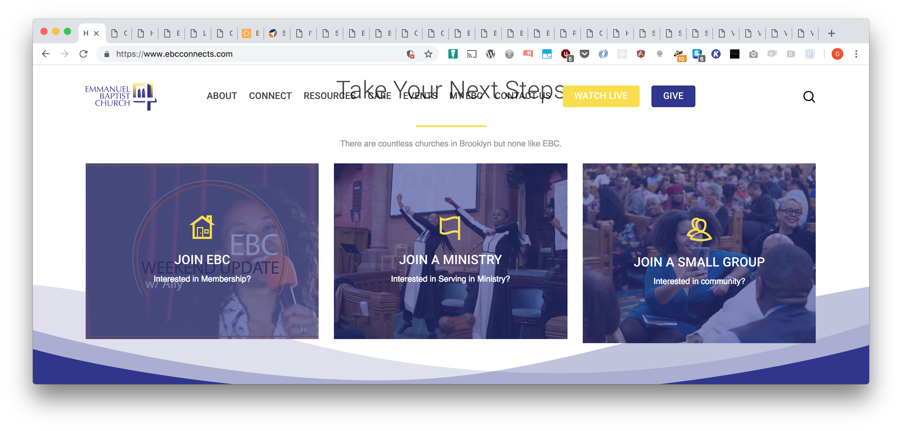
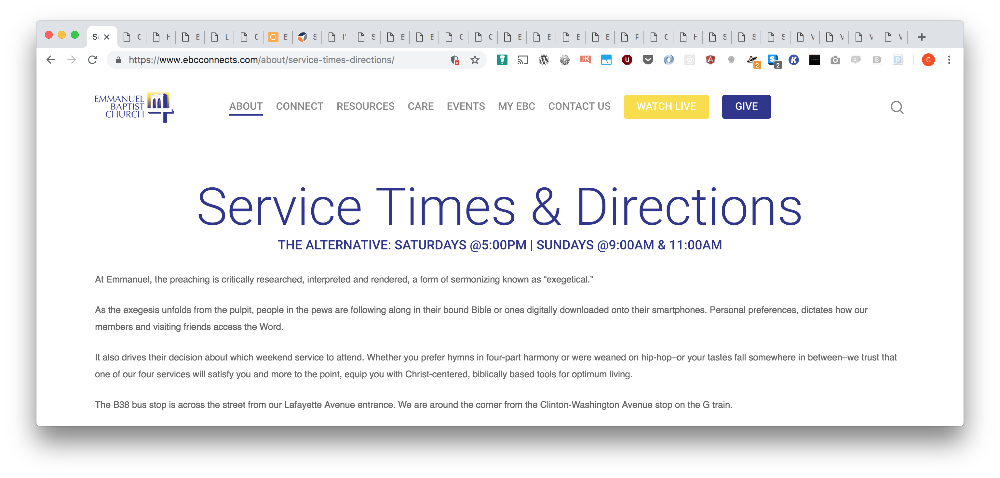
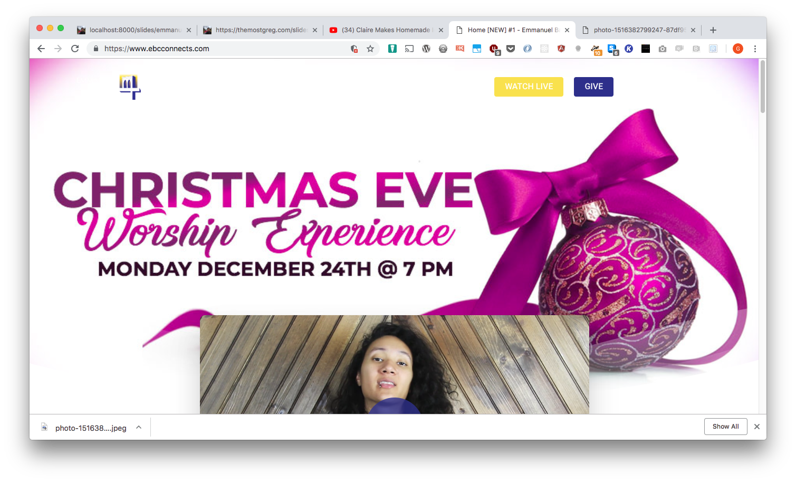
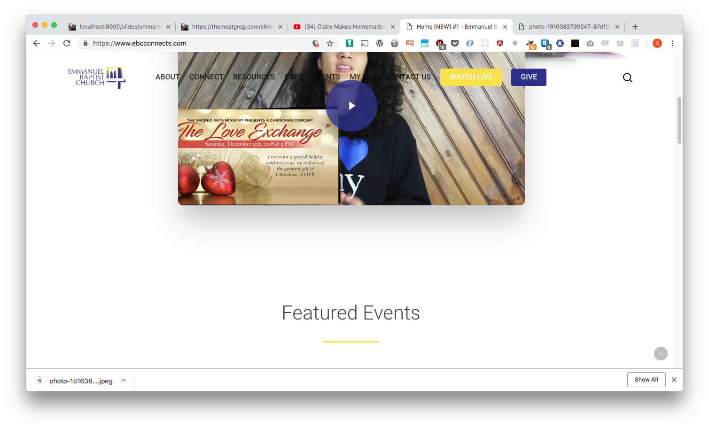
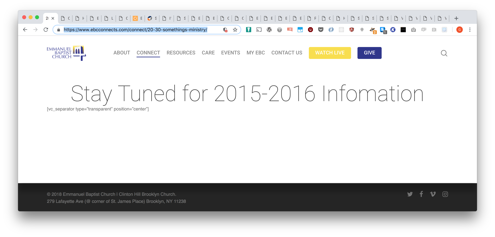
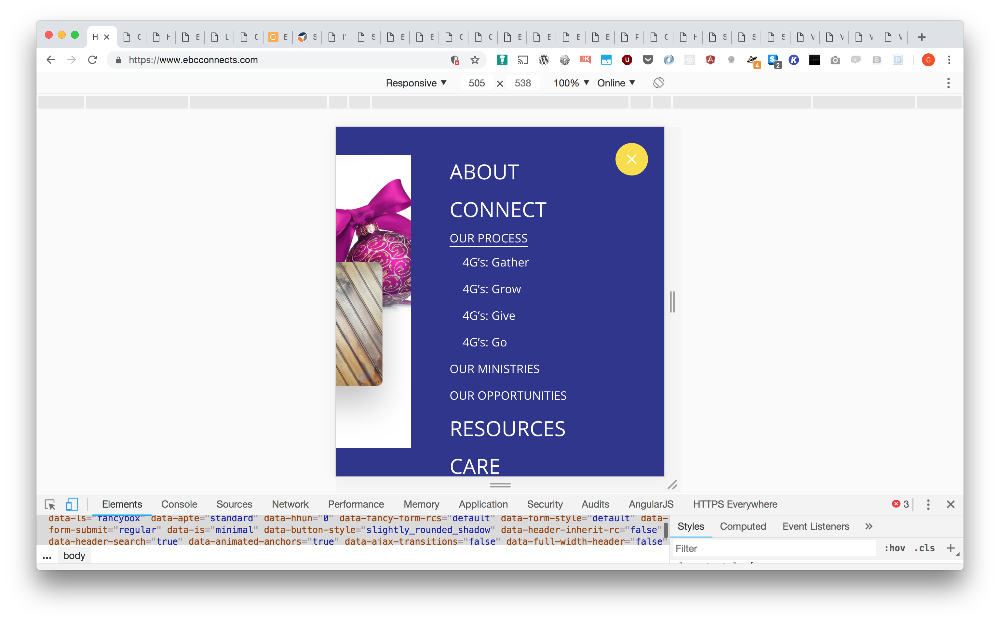
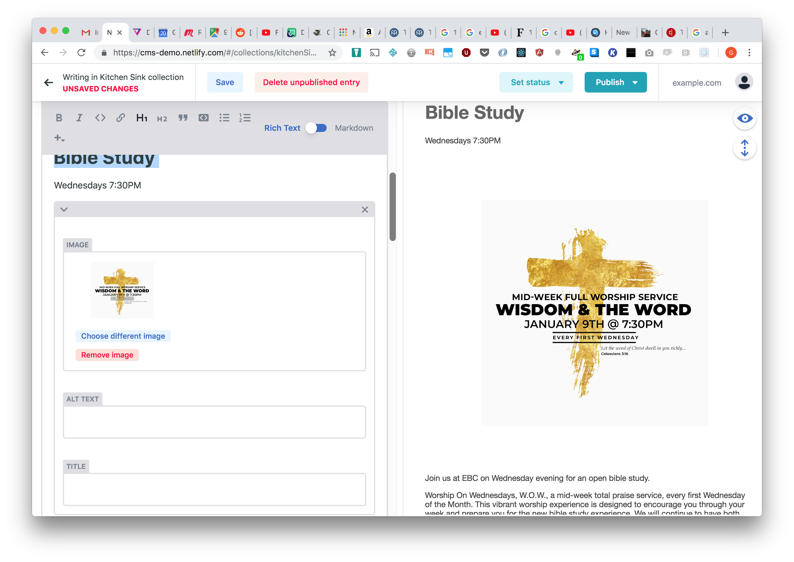

# Emmanuel Baptist Church

#### Proposal for website services

---

## WHY HAVE A WEBSITE?

---

### Websites are your face to your online audience.

---

### Websites are your face to your online audience.

- They show people what you do.
- They give people knowledge of how to interact with your services.
- They show your message.
- They communicate what you offer.

---

### Why for EBC?

---

#### Websites show what you are offering your community

---

#### They show your services and  events.

---

#### Show people how they can support you /donate to you.

---

#### Evangelize through important works you have done.

---

## NEED

---

### After looking over your website

---

### After looking over your website (pros)

- it is a very interactive website
- it is strongly designed full of bright colors
- displays current events readily on the home page

---

#### Still it is hard to find meaningful information about services.

- Not on the front page
- What is the Alternative?
- Do you mean Alternate?  Alternate weeks?

---

#### Some best practices aren't being followed.

Where's the menu?

---

#### Some best practices aren't being followed (cont).

Ohhh there's the menu!

---

#### There are some pages that lead to empty information.

... still waiting

---

#### It's very difficult to navigate on mobile.

---

## GOALS

---

### Your site should be simple to use

---

#### Recommendations

- A simpler interface for website (especially on mobile mobile).
- removal of dead links (don't bring you to another page) or pages that have no information.
- A front page that displays relevant service times and church projects.
- Analytics to see how many users donate, who is on the site and when and just to track which pages the members use.

---

## STEPS OPTIONS

---

### Two possibilities to support EBC.

---

### Option 1: Cleaning up existing Wordpress site which involves:

- removing dead links
- This requires just managing the Wordpress content and keeping it up to date.  
- Also cleaning up pastor's blog.
- Also adding Google analytics to see how the congregation uses the site to see which pages are useful and which pages need help.    

---

#### Option 1: Cost/Benefit

With this option the work will be using the current architecture but it will be more work (if even possible) to change the flow of the site.

---

### Option 2: Rebuild the website.

- With this option, work will be done with your designer to rebuild the site however you want.
- There will be a panel to upload content via Wordpress or Netlify.
- Assistance will be given with any issues concerning user flow and organization of data/content.

---

#### Option 2: Rebuild mobile experience

- The moble experience will also be cleaned up on the site so it is simpler to use.
- Easy navigation to service times.
- Easy to use menu.

---

#### Option 2: Event Upload Control panel.

- You will be given access to a event uploading for so you can upload events yourself.
- You just need to upload the event to a control panel and it will be consistent in the entire site.
- Will update the calendars and update links to the events.

---

#### You will not need to contact anyone to update events on the site.  It can be done all in-house!

---

### Option 1 vs Option 2

- Option 1 will be quicker in the short term
- Option 2 will only cost more up front and will cost only a maintenance fee afterwards.  

---

| Features             | Option 1        | Option 2                     |
| :------------------: |:---------------:| :---------------------------:|
| Custom Site          |                 |               x              |
| Upload own Pages     |                 |               x              |
| Clean up dead links  |       x         |               x              |
| Google Analytics     |       x         |               x              |
| Mobile Experience    | Same as current |      Responsive and Clean    |
| Upload Events        |                 | Upload and pages will update |
| Consistent Site Data |   When Noticed  |    Always and Automatically  |

---

## NEXT STEPS

---

### NEXT STEPS

- Get back to me if you would like further information.
- I'm always available for more recommendations.

---

## ABOUT GREG

---

### ABOUT GREG

- A developer with 7 years of experience in frontend, backend, website developer and machine learning.
- Worked everywhere from small companies (Mashwork 12 people) medium sized companies and large companies (Microsoft).
- Able to help people work well together in organizations and make things run cleanly.
- Always has a lot of energy and is always excited to see his clients succeed!

---

## Thanks!

#### Thank you very much for your time.  Contact me soon!
